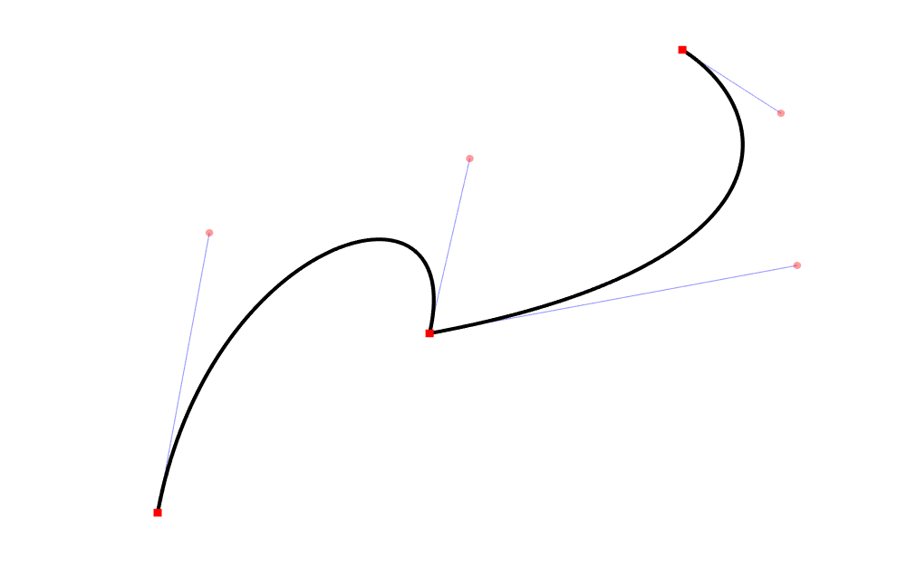

# Chain of Bézier curves

Construction of a chain from cubic Bezier curves. Four points are required to set the first curve, then every 3 points set the next curve connected to the previous one. It is possible to switch a smooth transition between two adjacent curves, this is done with the help of a square (button) in the upper left corner. Points can be transferred freely.

The program is written using the [SFML](https://www.sfml-dev.org/) library, so you will need to add it to the project.

## Examples

### Normal mode:

### Smoothing mode:

